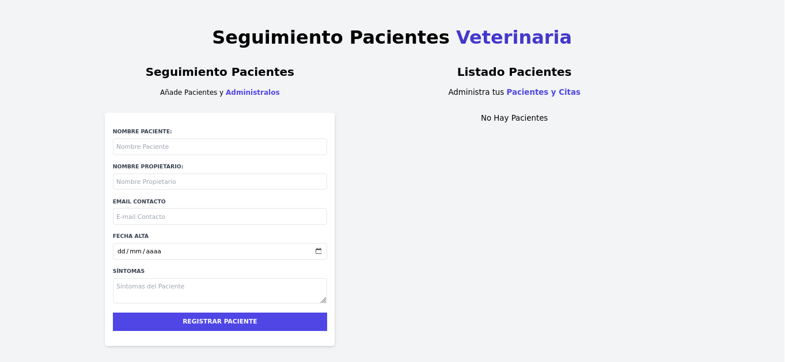

# Proyecto Administrador de Pacientes Veterinaria

## Indice
* [Descripción](#descripción-del-proyecto)
* [Funcionalidades](#funcionalidades-del-proyecto)
* [Tecnologías](#tecnologías-utilizadas)
* [Acceso](#acceso-al-proyecto)

## Descripción del proyecto
Este proyecto se enfoca en un administrador de pacientes para una veterania, la cual permite llevar el registro de todos los pacientes ingresados. Asi mismo, se puede modificar la información de la cita de dicho paciente como eliminarla en caso de ser necesario.

## Funcionalidades del proyecto
- `Creación citas`: Se pueden crear las citas de los pacientes y almacenarlas.
- `Actualización citas`: Se puede modificar la información de la cita creada con anterioridad.
- `Eliminar citas`: Acción que tiene de tarea borrar los registros previamente realizados.

## Tecnologías utilizadas
- HTML
- Tailwind CSS
- Javascript

## Acceso al proyecto
Para poder acceder al código del proyecto, simplemente debes descargar el codigo.

